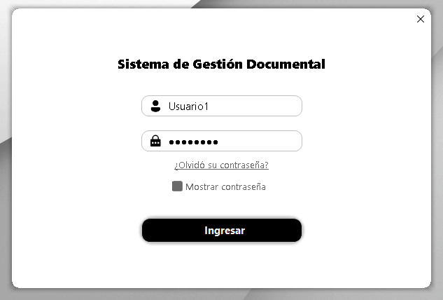
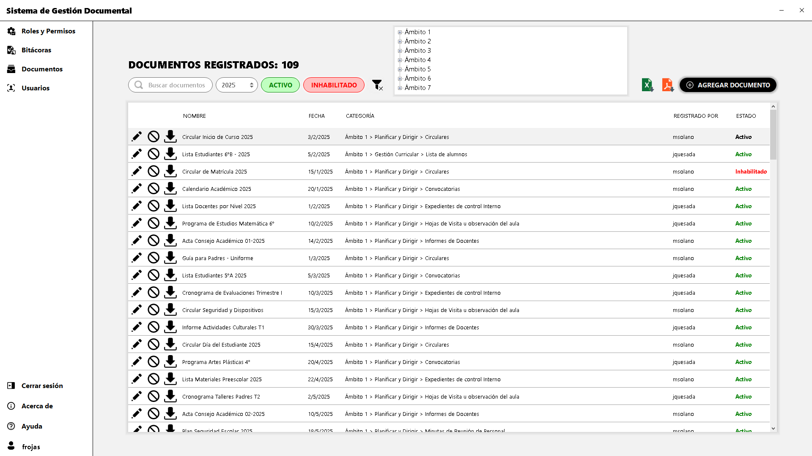

# 📑 Sistema de Gestión Documental (SGD)

**Proyecto Profesional Informático (PPI)** — Universidad Tecnológica Costarricense (UTC).  
Solución desarrollada en **C# (.NET Framework)** con **SQL Server** bajo arquitectura en capas.  
El sistema fue implementado en una institución educativa y está actualmente en uso.  

> ⚠️ Nota: el código fuente completo no se publica por razones de confidencialidad. Este repositorio incluye documentación técnica, esquema de base de datos y recursos para comprender la arquitectura y el funcionamiento del sistema.

---

## 🚀 Características principales
- 📂 Registro, consulta y control de documentos.  
- 👥 Gestión de usuarios, roles y permisos.  
- 📝 Trazabilidad (bitácora) de accesos y movimientos.  
- 📊 Generación de reportes en PDF/Excel.  
- 🏛️ Arquitectura en capas (Presentación · Lógica · Datos).  

---

## 🛠 Tecnologías utilizadas
- **Lenguaje / Backend:** C# (.NET Framework)  
- **Base de datos:** SQL Server  
- **Entorno de desarrollo:** Visual Studio  
- **Gestión de proyectos:** Azure DevOps  
- **Control de versiones:** GitHub  

---

## 📷 Capturas de pantalla
### 🔑 Login

### 📂 Gestión de documentos

---

## 📄 Documentación
Este repositorio incluye documentación complementaria en la carpeta [`/docs`](./docs):

- [`architecture.md`](./docs/architecture.md) → Arquitectura del sistema (capas, patrones y consideraciones de seguridad).  
- [`database-design.md`](./docs/database-design.md) → Modelo entidad-relación y diseño de la base de datos.  
- [`Manual de usuario SGD.pdf`](./docs/Manual%20de%20usuario%20SGD.pdf) → Manual completo de uso del sistema.  

---

## 👨‍💻 Autor
**Fauricio Rojas Castro**  
Proyecto profesional implementado en una institución educativa real.
