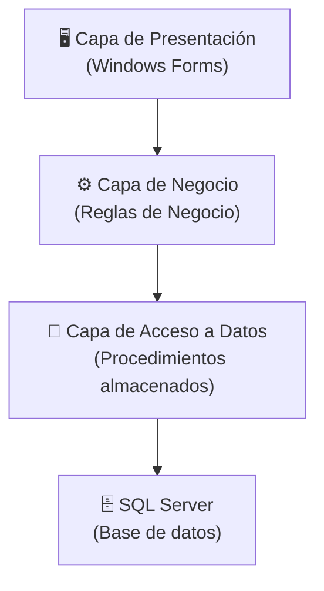

# 🏛️ Arquitectura del Sistema - Sistema de Gestión Documental (SGD)

El **Sistema de Gestión Documental (SGD)** fue desarrollado bajo una **arquitectura en capas**, asegurando separación de responsabilidades, escalabilidad y facilidad de mantenimiento.

---

## 🔹 Diagrama de Arquitectura

---

## 🖥️ Capa de Presentación
Implementada en **Windows Forms (C# .NET)**, es la interfaz con la que interactúan los usuarios.  
- Permite gestionar documentos, realizar búsquedas y acceder a funcionalidades según los permisos asignados.  
- Diseñada para ser simple, intuitiva y con mínima curva de aprendizaje.  

---

## ⚙️ Capa de Negocio (Business Logic Layer - BLL)
Procesa todas las **reglas de negocio**.  
- Control de creación, consulta, modificación e inhabilitación
- Implementa validaciones antes de enviar las solicitudes a la capa de datos.  
- Manejo de roles, seguridad y excepciones.
  
---

## 💾 Capa de Acceso a Datos (Data Access Layer - DAL)
Responsable de la **comunicación con la base de datos**.  
- Procedimientos almacenados para seguridad y rendimiento.  
- Aísla la lógica de negocio del acceso a datos.  
- Garantiza escalabilidad y mantenibilidad del sistema.  

---

## 🗄️ Base de Datos
Construida en **SQL Server**, incluye:  
- Tablas normalizadas.  
- Procedimientos almacenados para operaciones críticas.  
- Vistas para consultas optimizadas.  
- Seguridad basada en roles de usuario.  

---

## 🧩 Patrones de Diseño Utilizados
- **Arquitectura en Capas:** separación clara entre presentación, negocio y datos.  
- **DAO (Data Access Object):** acceso desacoplado a la base de datos.  
- **Repository Pattern:** centralización de la lógica de persistencia.  

---

## 🔐 Consideraciones de Seguridad
- Acceso restringido por roles de usuario.  
- Uso de procedimientos almacenados en lugar de consultas directas.  
- Validación de entradas contra SQL Injection.  
- Registro (auditoría) de operaciones críticas en la base de datos.  

---

## 🚀 Consideraciones de Despliegue
- Aplicación de escritorio distribuida en **red local**.  
- Base de datos centralizada en un **servidor SQL Server**.  
- Instalación mediante instalador MSI con dependencias necesarias (.NET Framework).  
